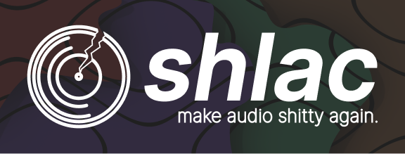

<p align="center"><a href="#"></a></p>
<p align="left"><a href="#"></a></p>
SHLAC <i>(from the Russian slang word "шлак", something crap)</i> - Super Horrible Lossy Audio Codec. A joky project to show how any audiofile works and attempt in creating of an easy-to-understand audioformat.


Inspired by FLAC - Free Lossless Audio Codec.

<hr>
<h1>What is it?</h1>
Basically, it's just an audio codec that has essential minimum to play the audio - binary data, containing headers with properties of the audiodata and audiodata itself.

<hr>
<h1>Why?</h1>
Idk, for fun.

<hr>
<h1>Benefits</h1>
<b>Surprisingly, there are some benefits:</b>

```
✅ Easy to understand

✅ True Lo-Fi

✅ Open to be community edited

✅ It's funny
```
