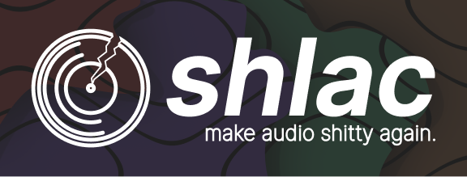

<p align="center"><a href="#"></a></p>
<p align="left"><a href="#"></a></p>
<b>SHLAC <i>(from the Russian slang word "шлак", something crap)</i></b> - Super Horrible Lossy Audio Codec. A joky project to show how any audiofile works and attempt in creating of an easy-to-understand audioformat.

<i>Inspired by FLAC - Free Lossless Audio Codec.</i>

<hr>
<h1>What is it?</h1>
Basically, it's just an audio codec that has essential minimum to play the audio - binary data, containing headers with properties of the audiodata and audiodata itself.

<hr>
<h1>Why?</h1>
Idk, for fun.

<hr>
<h1>Benefits</h1>
<b>Surprisingly, there are some benefits:</b>

```
✅ Easy to understand

✅ Lo-Fi

✅ Open to be community edited

✅ It's funny
```

<hr>
<h1>Suggest me your commits</h1>
I wouldn't call myself a developer, because it's more a kind of hobby, so things I'm making are some kind of shit.
Nevertheless, this codec and it's tools are open for your commits and suggestions.
Edit the codec itself, suggest new tools or try to integrate it somewhere - everything will make this project better.

<b>Following things are very welcome, because I can hardly implement them on my own, so I'd appreciate your submissions:</b>
- foobar2000 decoder plugin
- Converter and player tools implemented in other programming languages
- SHLAC's technical imrovements

<b>Have fun!</b>
